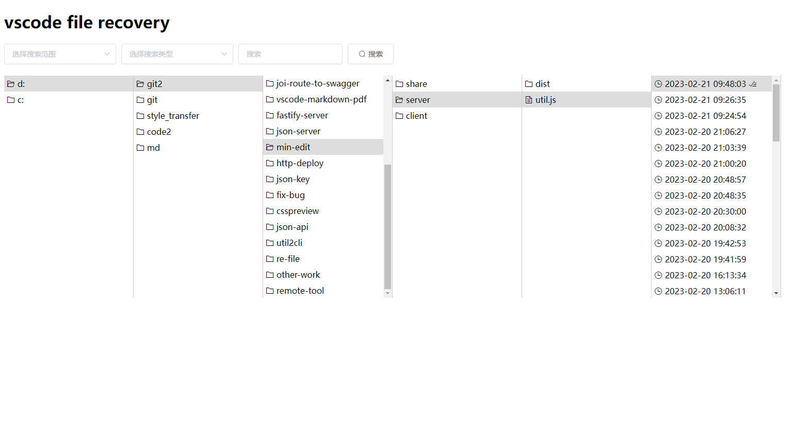

Restore all code files from vscode's History directory.


<p align="center">
  
  
</p>

## Use?

``` sh
# Install
npm i -g vscode-file-recovery

# Use
vscode-file-recovery
```

## Why?

One day my data disk was broken, and it was no longer possible to repair it from the hard disk or restore it from git. Fortunately, there are still clues in the History directory of vscode. This project can analyze these files and suddenly restore the original project structure.

## License

MIT
